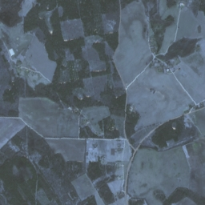
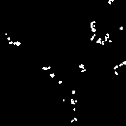
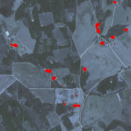

# Image Segmentation using U-Net

This repository provides the implementation for training and evaluating a U-Net model for image segmentation using a ResNet-34 encoder.


## Sample Results

| Raw Image       | True Mask       | Predicted Mask*  |
|-----------------|------------------|------------------|
|  |  |  |

* Overlay made using a model trained with 100 epochs, 16 batch size, and learning rate 0.001.

## Setup
To get started, follow these steps:

### 1. Clone the repository:

```
git clone https://github.com/magnumical/image_segmentation.git
cd image_segmentation
```

### 2. Create Conda environment:
```
conda create --name segmentation_env python=3.12.4
conda activate segmentation_env
``` 

### 3. Install the required packages:
```
pip install -r requirements.txt
```

### 4. Training the model (Optional) --> ```train.py```:
to train the model, user following script: 
```python train.py --batch_size <batch_size> --epochs <epochs> --learning_rate <learning_rate> --dataset_path <path_to_dataset>```

for example: 

```python train.py --batch_size 8 --epochs 1--learning_rate 0.0001 --model_save_path unet_model.pth --dataset_path dataset.pickle ```

**NOTE**: YOU NEED TO PLACE  ```dataset.pickle```  inside the main folder.

**NOTE**: You can skip this step, since I already trained 2 models (over 1 batch, and over 50 batch) and placed it inside the repo.


### 5. Inference:
To run inference using the trained model, use the following command:
```python inference.py --dataset <path_to_dataset> --model <path_to_trained_model>```

for example: 

```python inference.py --dataset dataset.pickle --model unet_50_epochs.pth```

## Evaluation Metrics

- IoU (Intersection over Union): Measures the overlap between predicted and true masks.
- Dice Coefficient: Balances precision and recall for segmentation tasks.

